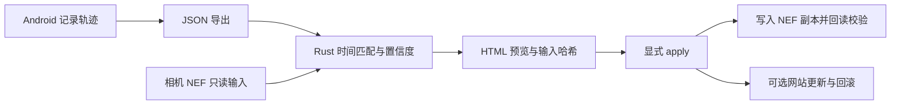

# TrailStamp

**用 Android 记录轨迹，让相机照片拥有可核对的拍摄地点。**

TrailStamp combines the GPSLog Android recorder with a Rust photo-geotagging CLI.
Local recording, explicit previews, and verified writes to photo copies.

这是一个面向摄影工作流的个人项目：手机保存轨迹，Rust 工具按照片时间匹配位置，
先生成 HTML 预览，再把 GPS 写到 Nikon NEF 的副本中。核心记录和导出无需账号、服务器或 API key。

## 能做什么

- **Android 轨迹记录**：耐力与精细步行两种模式，前台通知、定位缺口记录、进程恢复，导出 JSON / GPX / CSV。
- **时间与位置匹配**：处理相机时区、钟差、轨迹间隔和精度，给出高/低置信度或未匹配结果。
- **保护原片**：RAW 原文件只读；执行前核对计划中所有输入的 SHA-256，只写独立目录中的副本。
- **可选网站集成**：按文档中的照片 JSON 契约补充位置，更新失败时回滚网站文件；不自动提交或部署网站。
- **可选轨迹上传**：需自行提供兼容的 HTTPS 后端及 token，默认关闭。仓库不包含托管服务。



## 平台与限制

| 部分 | 支持范围 |
| --- | --- |
| Android 应用 | Android 10+，需要 Google Play services；后台行为取决于设备厂商。 |
| Rust `inspect`、单元测试 | Windows、macOS、Linux；不需要相机、网站或 ExifTool 运行环境。 |
| RAW 的 `doctor` / `preview` / `apply` | 当前面向 Windows；内嵌的是 Windows ExifTool，macOS/Linux 不能执行这条链路。 |
| Android 构建 | JDK 17、Android SDK Platform 35、Gradle wrapper；可在 Windows、macOS、Linux 开发。 |

完整户外 8 小时续航和精细步行精度仍需在目标设备上实测。已知厂商限制见
[Android 兼容说明](docs/ANDROID_COMPATIBILITY.md)，本次验证范围见 [验证记录](docs/VALIDATION.md)。

## 一分钟试用匹配引擎

安装 [Rust 1.95+](https://rustup.rs/)，从仓库根目录运行：

```sh
cargo run --locked --bin gpslog-geotag -- inspect --track fixtures/sample-track.json --at 2000-01-01T00:04:00Z
```

预期输出：`usablePoints: 2`、`maxUsableGapSeconds: 240`，以及 `high` 置信度的位置匹配。
样例使用 2000 年的虚构时间和 **0°, 0°** 坐标，不含私人轨迹。该命令只读，不修改文件。
完整的实跑结果见 [示例输出](docs/examples/inspect.json)。

`inspect` 不带 `--at` 时只输出轨迹数量、缺口与警告；指定时间时还会输出匹配位置。
分享自己的输出前请检查其中是否有不想公开的位置信息。

## 构建与检查

Rust（所有开发平台）：

```sh
cargo fmt --all -- --check
cargo test --locked --workspace --all-targets
cargo clippy --locked --workspace --all-targets -- -D warnings
cargo build --locked --release --bin gpslog-geotag
```

Android（安装 JDK 17 和 SDK Platform 35 后）：

```sh
# macOS / Linux
./gradlew testDebugUnitTest lintDebug assembleDebug
```

```powershell
# Windows
.\gradlew.bat testDebugUnitTest lintDebug assembleDebug
adb install -r app\build\outputs\apk\debug\app-debug.apk
```

Android Studio 可直接打开仓库。命令行环境需设置 `JAVA_HOME`、`ANDROID_HOME`，
或在未跟踪的 `local.properties` 中配置 `sdk.dir`。构建初次运行会下载依赖。
详细说明见 [开发与贡献](CONTRIBUTING.md)。本仓库使用本地检查，不配置 GitHub Actions。

## Android 使用

1. 授予精确定位、通知权限，再在系统设置中允许后台定位。
2. 按 [厂商说明](docs/ANDROID_COMPATIBILITY.md) 配置后台运行。Samsung 需要“不受限制”和“从不休眠的应用”。
3. 从可见首页开始记录。耐力模式适合长时间拍摄；精细步行模式更耗电，结束活动后及时停止。
4. 停止后在会话详情导出。文件含精确位置与时间，请放在 `private/` 或 `tracks/` 等未跟踪目录中。

“联网解析行政区”和“自动上传”是独立开关，默认关闭。数据保存与网络行为见 [隐私说明](docs/PRIVACY.md)。

## Windows 照片写入

需要自己的 NEF、匹配时间范围的轨迹，以及符合 [网站契约](docs/SITE_INTEGRATION.md) 的目录。
网站集成目前仍是 CLI 参数的一部分；不使用网站更新时，也需提供用于匹配的 JSON 目录，
并省略 `--update-site`。这项限制已明确保留，后续可独立改进。

```powershell
target\release\gpslog-geotag.exe preview `
  --track private\session.json `
  --raw-dir private\raw `
  --site-repo private\site `
  --album '2000\demo' `
  --timezone Asia/Shanghai `
  --clock-offset '+00:00:00' `
  --report-dir reports\preview

# 检查 reports\preview\report.html 后，再显式执行
target\release\gpslog-geotag.exe apply `
  --plan reports\preview\plan.json `
  --raw-out private\geotagged
```

上面的相册名只是示例，请替换成自己的测试相册。原片与输出目录必须分离。
低置信度及覆盖既有 GPS 都需要显式选项；具体规则见 [安全边界](docs/SAFETY.md)。

## 代码导航

| 路径 | 内容 |
| --- | --- |
| `app/` | Kotlin、Compose、Room、定位服务与导出 |
| `tools/geotag/` | Rust 匹配、预览、哈希校验、ExifTool 调度与回滚 |
| `fixtures/` | 合成轨迹、匹配边界案例与故意失败的网站夹具 |
| `docs/` | [架构](docs/ARCHITECTURE.md)、格式、隐私、兼容性与验证 |
| `scripts/` | 本地检查、Windows 构建、设备监测及显式选择输入的端到端检查 |

## 许可证

GPSLog 原创代码使用 [MIT License](LICENSE)。ExifTool、Gradle、Android 库和 Rust 依赖
保留各自许可，见 [第三方说明](THIRD_PARTY_NOTICES.md)。请不要在 issue、提交或附件中上传
真实轨迹、原片、签名密钥、token 或未脱敏的设备日志；详见 [SECURITY.md](SECURITY.md)。
